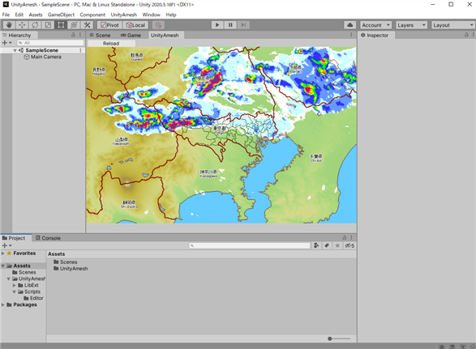

# UnityAmesh

## Dependent Libraries
  - [GitHub - gwaredd/mgGif: A unity library to parse GIF files and extract the images as textures](https://github.com/gwaredd/mgGif)

## Copyright and license
Copyright (c) 2020 yoggy

Released under the [MIT license](LICENSE.txt)
